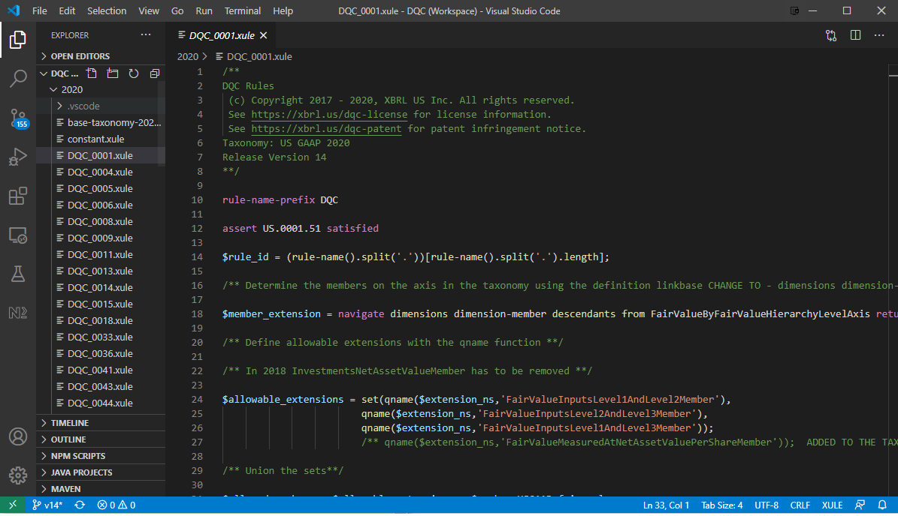

# XULE Editor 
*_A language syntax highlighter and code completion extension for editing [Xule](https://xbrl.us/xule) with Visual Studio Code._*
<br /><br /><div style="text-align:center"> **becomes -->** </div>
### What's Here

The editor can be used for any .xule files; this documentation assumes you have a Visual Studio Code .code-workspace definition set up for a [Data Quality Committee Rules release (DQC)](https://github.com/DataQualityCommittee/dqc_us_rules/releases) that contains [.xule](https://xbrl.us/xule) reference implementation files.  

The files in the .zip linked below include: 
1. .json settings files for the Xule Editor extension, 
1. US GAAP and IFRS Taxonomies in .json format that are readable by the Xule Editor, and 
1. a .code-workspace-update file that should be copied into your exisiting workspace file.  These additional elements enable highlighting and code completion. 

### Getting Started
1. Install the latest [Xule Editor](https://marketplace.visualstudio.com/items?itemName=XBRLUS.xule) from the Visual Studio Code Marketplace.
<br /><div style="text-align:center"></div>

1. **Extract the [dqc-xule-settings.zip](dqc-xule-settings.zip?raw=true)** archive into the ```dqc_us_rules``` subdirectory of the release, so that the **```taxonomy``` folder is at the same level as the existing ```source``` folder**.
<br /><div style="text-align:center"></div><br /><br />
**Proceed with caution** - the extract process will create **_or replace_** ```.vscode``` folders with settings files in the source subfolders by year, corresponding to US GAAP and IFRS Taxonomies, and will also create a .code-workspace-update file next to the new ```taxonomy``` folder. If you are not sure how to proceed safely, consider manually copying from the files in the .zip into the appropriate settings file.  **XBRL US is not responsible for overwritten settings.**

### Confirming the Xule Editor extension
Once the settings.json files are extracted to .vscode subfolders in each year subfolder, open Visual Studio Code workspace for DQC Rules on your desktop, then open a .xule file for one of the DQC Rules - your view should resemble the IDE in the image at the right up above.  If it does not, or if you have warnings or errors listed for the file like the image at left below, try the following steps:

1. Check the location of the settings.json file(s) and the contents of the file itself against the corresponding file(s) in the .zip, to be sure the xule.autoImports and xule.namespaces.definitions are correct.
1. Check the location of the ```taxonomy``` folder and its contents, to be sure it matches the contents of the .zip archive.
1. Mac users might need to remove the '../../lib/' string from the *_functions.xule_* and *_version.xule_* entries.
1. Check that the settings.json file is being read properly by the Xule Editor extension - open the settings for the extension, then browse to the corresponding folder(s) using the dropdown, to confirm that the Auto Imports and Namespaces: Definitions are listed, as in the image at right below.  If not, try uninstalling and reinstalling the Xule Editor extension.
 
<div style="text-align:center"> &nbsp; </div>

## About the Xule Editor Extension

## Requirements

All dependencies are available from npm and the build process installs them automatically.

## Extension Settings

There are no settings so far.

## Known Issues

None so far.

## Release Notes

See the [Changelog](CHANGELOG.md).

## Building and Testing

To compile the extension use: `npm run compile`. This will also rebuild the lexer and the parser from the grammar.
To package it: `vsce package`.
To run the tests: `npm run test`.

## Development and Debugging

If we open the extension directory with VSCode, we can:

 * Build and watch for modifications: on OSX, Cmd+Shift+B
 * Launch a new VSCode window with the development extension installed: "Run" panel (Cmd+Shift+D on OSX) and launch the configuration "Client + Server". With this, VSCode should attach the debugger and stop at breakpoints.
 
### Notable extension points

 * Built-in taxonomies are defined in builtInNamespaces.ts.
 * Built-in variables, constants, and some keywords are defined as wellKnownVariables in symbols.ts.
 * Built-in functions and properties and other identifiers/keywords are defined at the bottom of semanticCheckVisitor.ts.
   * These are used by the semantic checker.
 * Syntax highlighting is defined in syntaxes/xule.tmLanguage.json. It includes both keywords and known identifiers (functions, constants, variables).
