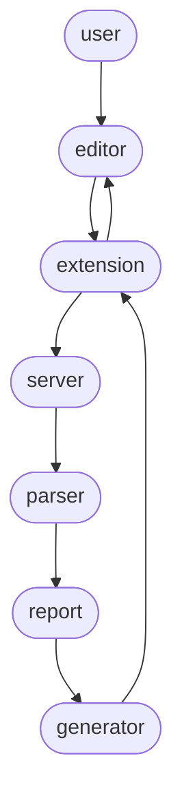

# XENDR Editor

A language syntax highlighter and code completion extension for editing XENDR files, a XULE output that produces inline XBRL from existing taxonomies and instance documents in CSV, HTML, XML or JSON formats.

## Examples

Check out the library of [example HTML templates](https://github.com/xbrlus/xendr-editor/tree/main/examples).

## Features

### Highlighting

`xendr.tmLanguage.json` defines the Textmate rules to highlight XULE code.
The rules are [injected](https://code.visualstudio.com/api/language-extensions/syntax-highlight-guide#injection-grammars) into the built-in HTML Textmate grammar.

The highlighting is applied only inside recognized XENDR elements.
Namespaces cannot be resolved syntactically, so any tag that ends with a recognized XENDR tag name works.

For example `expression`, `xule:expression`, `foo:expression` are all considered XENDR tags regardless of `foo` or `xule` pointing to the XENDR namespace or not: http://xbrl.us/xendr/2.0/template

Inside XENDR elements, it highlights the code replicating the Textmate rules present in the XULE extension, with minor modifications to better handle word boundaries around HTML tags.

The rules' regular expressions and the associated token categories could be improved, but have been kept as-is for consistency with the original XULE extension.

## Diagnostics and completions

The key idea is to reuse the existing XULE extension to resolve the diagnostics and completions of XULE code inside the HTML.

For this, we generate a `.html.xule` file that contains just the XULE code present in the original XENDR `.html` file.
We maintain the position of the XULE code in the HTML file to map diagnostic and completion locations precisely.

The XULE code is enriched with namespaces, output statements, and some list() expressions to make the file semantically correct, but the functionality of the XULE code is never altered.

To generate the XULE file from the XENDR file in real time, we leverage a language server that tracks and understands XENDR files.

### Language server

The program flows linearly in the language server:

1. When the user opens or edits a file the editor raises an event.
1. The extension captures the event and notifies the language server using the [LSP](https://microsoft.github.io/language-server-protocol/).
3. The language server parses the current file, extracting the relevant information into a report
4. A code generator creates the content for the XULE file.
5. The language server communicates back to the extension to create the XULE file with this content.

If the file has diagnostics, the extension will detect them and show them correctly positioned over the html file.

If the edit triggered a completion request, the extension redirects the request to the XULE extension (pointing to the generated XULE file). The returned completions are added to the possible completions in the html file.
