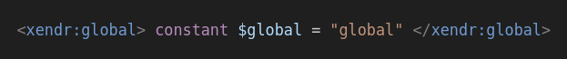
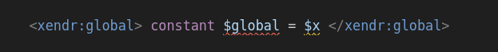
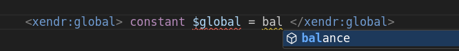
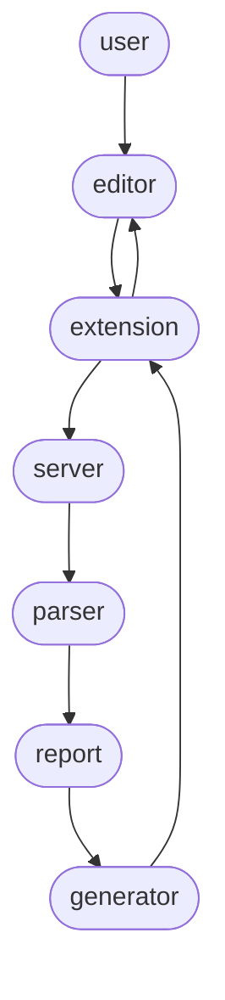

## High level overview

The goal is to add three features to XENDR files in vscode:

* Highlighting
* Diagnostics
* Completions

The approach is to create a vscode extension that tracks XENDR files and:

* Injects new Textmate rules into the built-in HTML grammar for highlighting XULE code within XENDR elements.
* Parses and extracts all the XULE code into a corresponding `.html.xule` file.
* Redirects the diagnostics and completions requests to the XULE language server extension that resolves them by analyzing the corresponding `.html.xule` file.

This way, the XULE extension can continue evolving and the XENDR extension will get automatically upgraded as it communicates with the XULE extension currently installed.

## Project structure

The whole project is a vscode extension.
The root README, logo, LICENSE and package.json files define the metadata of the extension.
The package-lock.json file locks the version of transitive dependencies to ensure consistency between installations.

The highlighting is done syntactically using a [Textmate grammar injection](https://code.visualstudio.com/api/language-extensions/syntax-highlight-guide#injection-grammars) located in the standard `syntaxes` folder.

Diagnostics and completions are possible thanks to a [language server](https://code.visualstudio.com/api/language-extensions/language-server-extension-guide) that communicates with the existing XULE language server.
All the code is under the  `source` folder.

The project includes vscode's `launch.json` and `tasks.json` files to facilitate building and debugging the server under the `.vscode` folder.

Finally, it includes technical documentation and example XENDR files to test the extension's features.

## Building the project

To build the project manually:
* Install node dependencies into `node_modules` with `npm install`
* Generate the `HTMLLexer` and `HTMLParser` Typescript files from the ANTLR grammar with `npm run generateParser`
* Bundle the client-side of the extension into `distribution/client.js` with `npm run bundleClient`
* Bundle the server-side of the extension into `distribution/server.js` with `npm run bundleServer`

To execute all of these tasks sequentially, run `npm run build`.

To remove all the generated files, run `npm run clean`.
Caution: This removes all files not being tracked by Git.

## Testing the extension

Once the project is built, run `npm run launchPlayground` to open a new vscode instance with the XENDR extension installed.

This vscode instance will open the examples folder as the main workspace.
You may play with the existing examples or add new ones.

Caution: Make sure you don't have the XENDR extension installed in vscode when executing the playground.
Otherwise, it will clash with the development extension causing errors.

## Debugging the language server

To debug the language server, open the project with vscode and launch the `Playground` debugging session from the debug menu or by pressing F5.

Playground is a compound debugging session that first builds the project, then launches the playground editor and finally attaches a debugger to the running language server process.

Now, if you place breakpoints in the language server's code and make an edit in a XENDR file, the execution will stop in the breakpoint for a comfortable debugging experience.

Caution: If the source code for the extension is minified, variables cannot be inspected by hovering over them.
Remove `--minify` from the `bundleClient` and `bundleServer` npm scripts for a better debugging experience.

## Features

### Highlighting

`xendr.tmLanguage.json` defines the Textmate rules to highlight XULE code.
The rules are [injected](https://code.visualstudio.com/api/language-extensions/syntax-highlight-guide#injection-grammars) into the built-in HTML Textmate grammar.

The highlighting is applied only inside recognized XENDR elements.
Namespaces cannot be resolved syntactically, so any tag that ends with a recognized XENDR tag name works.

For example `expression`, `xule:expression`, `foo:expression` are all considered XENDR tags regardless of `foo` or `xule` pointing to the XENDR namespace or not: http://xbrl.us/xendr/2.0/template

Inside XENDR elements, it highlights the code replicating the Textmate rules present in the XULE extension, with minor modifications to better handle word boundaries around HTML tags.

The rules' regular expressions and the associated token categories could be improved, but have been kept as-is for consistency with the original XULE extension.

## Diagnostics and completions

The key idea is to reuse the existing XULE extension to resolve the diagnostics and completions of XULE code inside the HTML.

For this, we generate a `.html.xule` file that contains just the XULE code present in the original XENDR `.html` file.
We maintain the position of the XULE code in the HTML file to map diagnostic and completion locations precisely.

The XULE code is enriched with namespaces, output statements, and some list() expressions to make the file semantically correct, but the functionality of the XULE code is never altered.

To generate the XULE file from the XENDR file in real time, we leverage a language server that tracks and understands XENDR files.

### Language server

The program flows linearly in the language server:

1. When the user opens or edits a file the editor raises an event.
1. The extension captures the event and notifies the language server using the [LSP](https://microsoft.github.io/language-server-protocol/).
3. The language server parses the current file, extracting the relevant information into a report
4. A code generator creates the content for the XULE file.
5. The language server communicates back to the extension to create the XULE file with this content.

If the file has diagnostics, the extension will detect them and show them correctly positioned over the html file.

If the edit triggered a completion request, the extension redirects the request to the XULE extension (pointing to the generated XULE file). The returned completions are added to the possible completions in the html file.

## Code overview

### Client.ts

The extension activates when an HTML file is opened in the editor, calling the `activate` function.
Then, `client.ts` enables three functions:
1. It starts a language client that communicates with the language server through [IPC](https://en.wikipedia.org/wiki/Inter-process_communication).
2. Sets a watcher for diagnostic events in `.html.xule` files, and replicates them in the original `.html` file.
3. Redirects the completions request to the XULE extension, preserving the position but specifying the generated XULE file as source.

## Server.ts

The language server initializes with full document synchronization and completion provider capabilities.
Then starts listening to didOpen and didChange events in HTML files.

When such an event happens, it parses the html file and extracts the relevant information into a report.

Reports are valid if they include the XENDR namespace.
For example, regular HTML files are ignored.

If valid, it generates the content for the corresponding XULE file and sends a workspace edit request to vscode that creates the file with the specified content.

## Parser.ts

The parser's responsibility is to extract all the relevant information from an HTML file.

First, it parses the HTML source string with the ANTLR parser into a parse tree.
Then, walks the tree searching for relevant elements. These are:
- XML namespaces
- XENDR elements identified by `namespace:tag` where namespace points to the XENDR namespace (http://xbrl.us/xendr/2.0/template) and `tag` is one of the recognized XENDR tags.
- `name`, `xendr:repeat` and `xendr:repeatWithin` attributes to resolve the name of XULE blocks correctly.

XULE code is organized in XULE blocks. XULE code sections with the same name are packed into the same XULE block and assigned a block kind depending on their structure.

## Report.ts

The report contains all the namespaces, the XULE code blocks and a flag indicating if any footnotes where present.

This file defines the data model for the XENDR reports and helper functions for easier access and modification.

## Generator.ts

With the report information, the generator creates the source text for the generated XULE file.

It starts with a headline declaring all the namespaces and the footnoteFacts constant if necessary.
Then goes block by block appending their source code.

Output statements and list() expressions may be added to the final code for making it semantically valid.
However, the original XULE code is kept intact, including its positioning inside the original file.